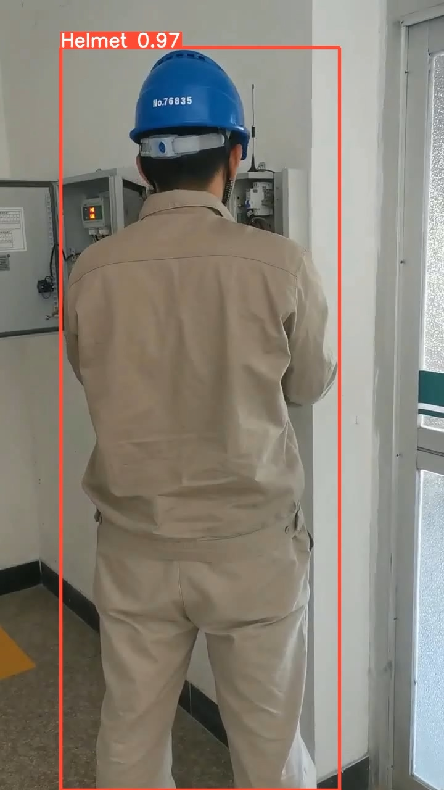
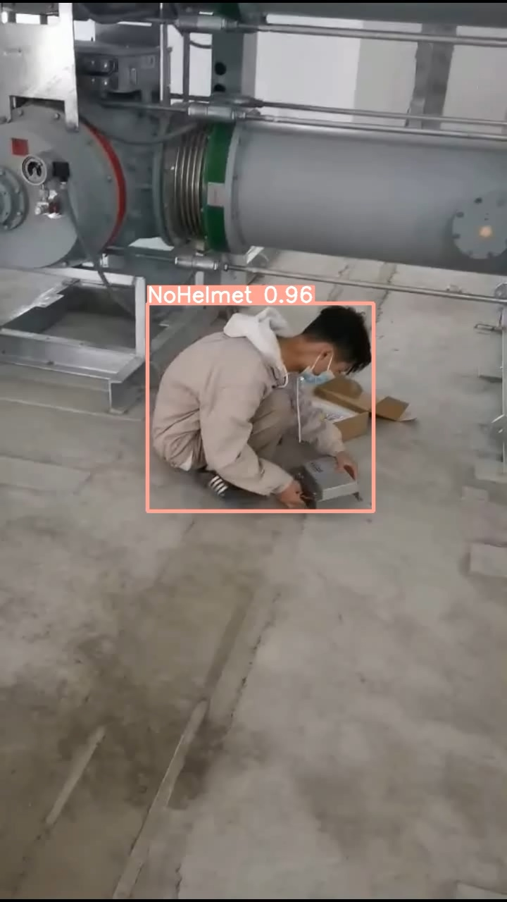
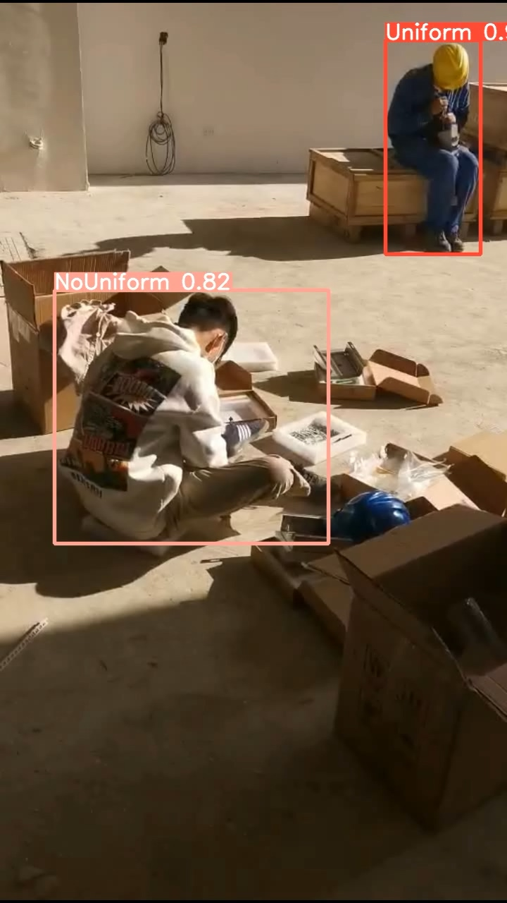
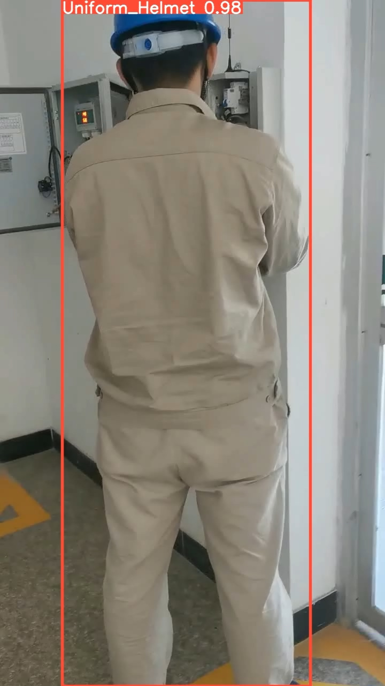
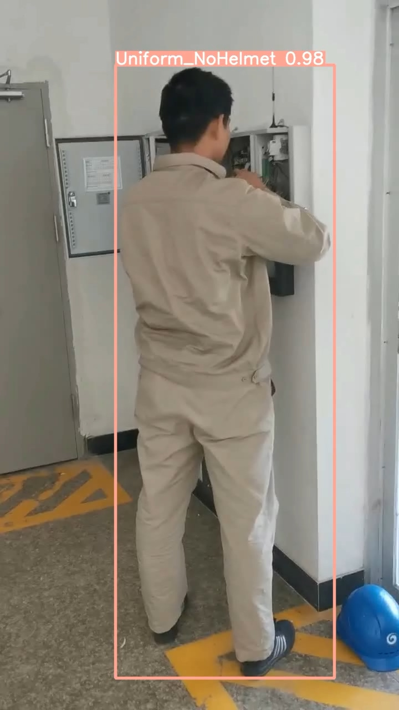
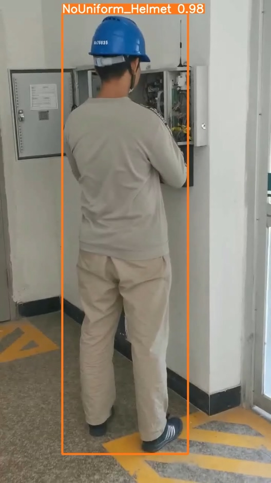
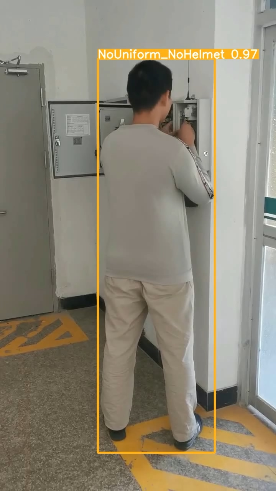

# A uniform and helmet detection project using yolov5

yolo repo [yolov5](https://github.com/ultralytics/yolov5).
 
## Demo
 

helemt

 

 

no helemt

 

uniform & nouniform

 

uniform_helmet

 

uniform_nohelmet

 

nouniform_helmet

 

nouniform_nohelmet

 

This project was eventually used on NVIDIA Jetson Nano and accelerated with [tensorrt](https://github.com/NVIDIA/TensorRT).
